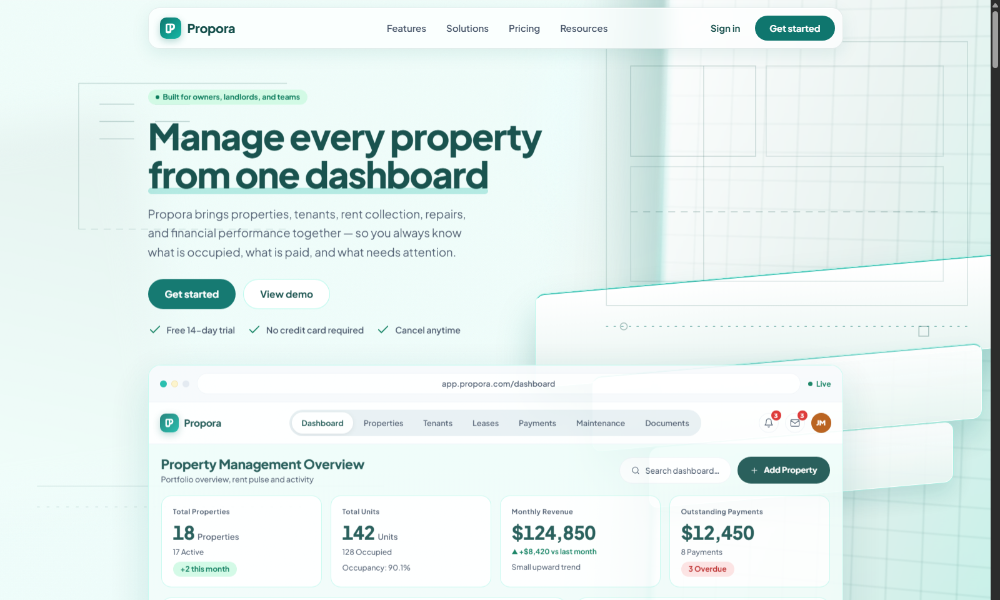

<div align="center">


# ProporaWebsite

### The pitch for Propora — property management, made legible.

The public marketing site: a single long-form landing page that sells the
[Propora dashboard](../Propora) — problem, product, proof, pricing, and a
call to action — without touching the app or its API.


**`MARKETING SITE · LANDING PAGE`**

</div>



---

## The idea

The dashboard app already has a fully worked-out visual identity — Trust Teal,
mint surfaces, pill actions, one type family. This site exists to sell that
product before anyone signs in: a single scroll from "here's the problem" to
"get started," reusing the same design language so the two feel like one
brand rather than a marketing site bolted onto an app.

It's a static, standalone build — no auth, no API calls, no shared runtime
with [Propora Dashboard](https://github.com/m0hkx/Propora-Frontend) or [Propora-API](https://github.com/m0hkx/Propora-Backend). Every number and
name on the page is realistic, hand-authored demo data (`src/data/site.ts`),
not a live feed.

## Page anatomy

One page, composed top to bottom in [`src/App.tsx`](./src/App.tsx):

| Section | Component | Purpose |
| ------- | --------- | ------- |
| Nav | `Navbar` | Frosted sticky bar, mobile menu, scroll-aware styling |
| Hero | `Hero` | Headline, CTA pair, a live-rendered `DashboardPreview` mock of the app |
| Trust bar | `TrustBar` | Quick social-proof chips |
| Problem | `Problems` | The "fragmented spreadsheets" pain, illustrated with a rent-roll mock |
| Features | `Features` | Feature grid with small inline visualizations |
| Showcase | `Showcase` | Deeper product walkthrough — rent roll, work orders, money split |
| Analytics | `Analytics` | Hand-rolled SVG charts — revenue trend, occupancy donut, property performance |
| Solutions | `Solutions` | Audience segmentation: landlords, property managers, real-estate teams |
| Pricing | `Pricing` | Starter / Portfolio / Team plans |
| Testimonials | `Testimonials` | Role-based placeholder quotes (explicitly not invented companies/claims) |
| Resources | `Resources` | Help center, checklists, templates |
| CTA | `Cta` | Final conversion section |
| Footer | `Footer` | Sitemap, legal links, brand |

Supporting pieces: `Atmosphere` (a fixed, non-interactive architectural-grid
backdrop, pure CSS/SVG, no animation library), `Reveal` (scroll-triggered
fade/slide-in wrapper), and `Icon` (a small hand-drawn stroke-icon set).

## Design system

Shares its brand language with the rest of Propora — see
[`design-system/colors.md`](./design-system/colors.md) for the full token
reference:

- **Palette** — Trust Teal `#0F766E` on mint `#F0FDFA`, deep-teal ink `#134E4A`
  (never pure black)
- **Type** — Plus Jakarta Sans throughout
- **Brand mark** — the Propora "P" logo (`src/assets/logo-mark.png` /
  `logo-mark-white.png`), flat teal in the footer/nav badge, white cutout on
  the teal badge itself
- **Motion** — `Reveal`'s staggered section entrances, `prefers-reduced-motion`
  safe

## Tech stack

| Layer | Choice |
| ----- | ------ |
| UI runtime | React 19 + TypeScript 6 |
| Build | Vite 8 (`tsc -b && vite build`) |
| Styling | Plain CSS — `landing.css` (sections) + `atmosphere.css` (backdrop) + `index.css` (base) |
| Data | Static demo data (`src/data/site.ts`) — no fetch, no backend |
| Icons | Hand-authored inline SVG (`components/Icon.tsx`) |
| Quality gates | `tsc -b` project references, ESLint flat config |

No router, no state library, no chart library — every chart on the page is
hand-rolled inline SVG.

## Getting started

```bash
npm install
npm run dev      # Vite dev server with HMR
npm run lint     # ESLint over the repo
npm run build    # type-check, then bundle to dist/
npm run preview  # serve the production build
```

No `.env` or backend connection required — this app is entirely self-contained.

## Project structure

```
src/
├── App.tsx            # page composition — the section order above
├── main.tsx           # entry point
├── index.css           # base tokens/reset
├── landing.css         # every section's layout + component styles
├── atmosphere.css       # the fixed backdrop
├── components/          # one file per section, plus Icon/Reveal/Atmosphere
├── data/site.ts         # all static demo data (rent roll, work orders, revenue series, …)
└── assets/               # logo marks, hero art
```

## Related repositories

Part of the Propora portfolio project — see the
[top-level README](../README.md) for the full picture.

| Repo | Role |
| ---- | ---- |
| [Propora](https://github.com/m0hkx/Propora-Frontend) | The dashboard this site sells |
| [Propora-API](https://github.com/m0hkx/Propora-Backend) | The backend behind that dashboard |

---

<div align="center">

Built as the front door to Propora — same brand, same craft, zero backend.

</div>
